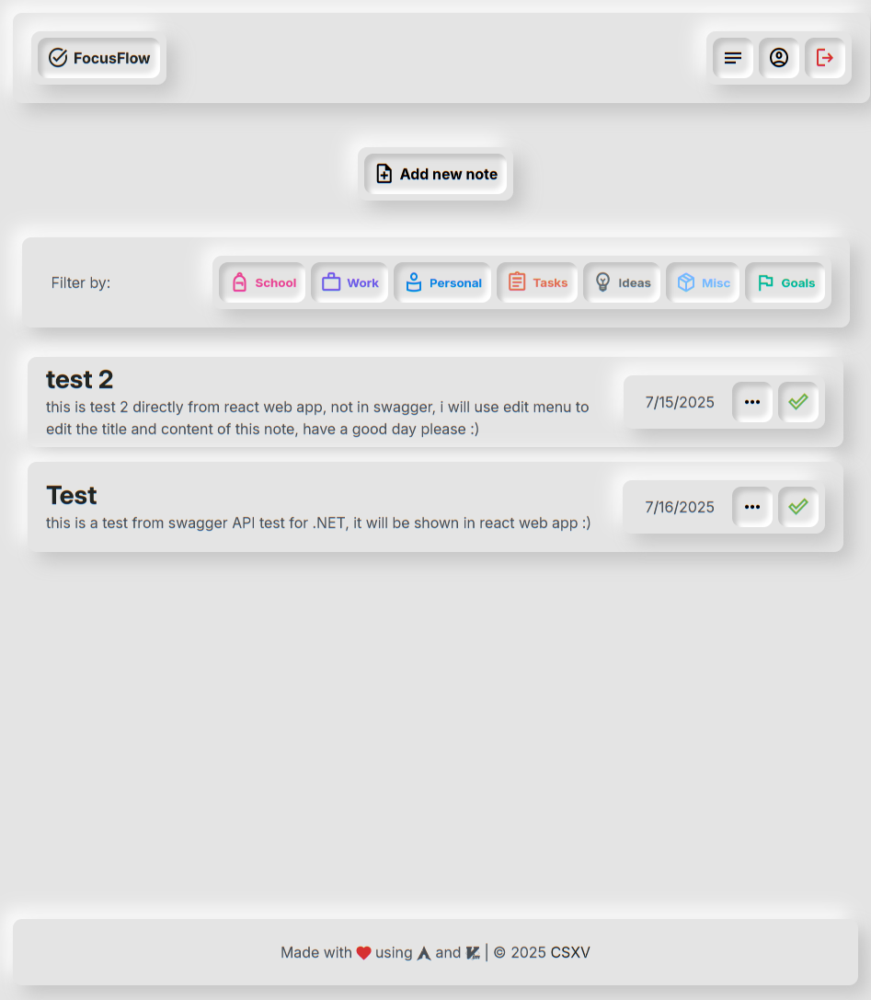

# FoucsFlow
A full-stack, pixel-perfect To-Do and Notes web app designed with **Neumorphism UI** and built for **ease of use**. The app supports user authentication, categorized notes, and an intuitive task management system.



more screenshots in pics folder.

## 🚀 Features
### ✅ Core App Features
- Create, update, delete, and **archive notes**
- Notes include **category tagging** (e.g., Work, Personal, Study)
- User authentication system (Register / Login / Edit / Delete Account)
- Responsive Neumorphic UI with **pixel-perfect styling**
- Built with modern technologies and optimized for performance

### 🎨 UI/UX & Design
- Neumorphism design for a modern, tactile interface
- Pixel-perfect spacing, typography, and color palette
- Focus on minimalism and ease of navigation
- Fully responsive and mobile-friendly
- Google Material Icons for category visualization (icons like work, fitness_center, home)

### 🧑‍💻 Tech Stack

| Layer      | Tech                                                     |
|------------|----------------------------------------------------------|
| Frontend   | React, Vite, TypeScript, HTML, CSS, React Router         |
| Backend    | .NET Core Web API, ADO.NET, 3-tier architecture          |
| Database   | PostgreSQL                                               |
| Styling    | Custom CSS, Neumorphism design system                    |
| Tools      | NPM, Vite, REST API                                      |

## 🗃️ Database Schema (Simplified)
### `Users` Table

| Field         | Type         | Description                       |
|---------------|--------------|-----------------------------------|
| id            | `serial`     | Primary Key                       |
| username      | `varchar(100)` | Unique username                 |
| email         | `varchar(255)` | Email address                   |
| passwordhash  | `varchar(255)` | Hashed password                 |
| firstname     | `varchar(100)` | User’s first name               |
| lastname      | `varchar(100)` | User’s last name                |
| profileimage  | `varchar(255)` | Optional profile image URL      |
| usertype      | `int`          | Role/permissions indicator      |
| createdate    | `timestamp`    | Auto-set on insert              |
| updatedate    | `timestamp`    | Auto-set on update              |
| isactive      | `bool`         | Soft delete flag (true/false)   |

### `Notes` Table

| Field         | Type          | Description                            |
|---------------|---------------|----------------------------------------|
| id            | `serial`      | Primary Key                            |
| title         | `varchar(255)`| Note title                             |
| content       | `text`        | Optional note content                  |
| userid        | `int`         | Foreign key to `users(id)`             |
| categoryid    | `int`         | Foreign key to `categories(id)`        |
| createdate    | `timestamp`   | Created timestamp                      |
| updatedate    | `timestamp`   | Updated timestamp                      |
| state         | `varchar(20)` | To Do, In Progress, Done, Archived     |
| ispinned      | `bool`        | Pin status                             |

### 🗂️ `categories` Table

| Field         | Type           | Description                |
|---------------|----------------|----------------------------|
| id            | `serial`       | Primary Key                |
| name          | `varchar(100)` | Category name              |
| iconname      | `varchar`      | Google Material Icon name  |

## 🧱 3-Tier Architecture (.NET Core)
### 1. **Presentation Layer**
- Handles HTTP requests and responses
- Maps API routes like `/api/Users`, `/api/Notes`, etc.

### 2. **Business Logic Layer**
- Encapsulates app rules and operations
- Validates, transforms, or aggregates data

### 3. **Data Access Layer**
- Executes SQL queries
- Connects to PostgreSQL using connection pooling
- Handles transactions and error recovery

## 🔧 Setup Instructions
### Prerequisites
- Node.js + NPM
- .NET 8 SDK+
- PostgreSQL

### 📦 Frontend (React + Vite)
```bash
cd toDoWeb
npm install
npm run dev
```

### ⚙️ Backend (.NET Core API)
Configure DataAccessLayer `_connectionString` string:

```json
"Host=localhost;Database=TodoDb;Username=postgres;Password=yourpassword"
```

Run the server:
```bash
cd toDoAPI/API
dotnet restore
dotnet run
```

## 🌐 REST API Endpoints
### 🔐 Auth & User
| Method | Endpoint                 | Description         |
| ------ | ------------------------ | ------------------- |
| GET    | `/api/Users/{id}`        | get a user by ID    |
| POST   | `/api/Users/Add`         | Register a new user |
| POST   | `/api/Users/login`       | Authenticate a user |
| PUT    | `/api/Users/Update/{id}` | Update user info    |
| DELETE | `/api/Users/Delete/{id}` | Delete user account |

### 📝 Notes
| Method | Endpoint                   | Description                 |
| ------ | -------------------------- | --------------------------- |
| GET    | `/api/Notes/AlllUser/{id}` | Get all notes for a user    |
| GET    | `/api/Notes/All`           | Get all notes (for testing) |
| GET    | `/api/Notes/{id}`          | Get a note by ID            |
| POST   | `/api/Notes/Add`           | Create a new note           |
| PUT    | `/api/Notes/Update/{id}`   | Update an existing note     |
| DELETE | `/api/Notes/Delete/{id}`   | Delete a note               |

### 🗂️ Categories
| Method | Endpoint               | Description         |
| ------ | ---------------------- | ------------------- |
| GET    | `/api/categories/All`  | List all categories |

## 🧪 Testing & Development
- Fast dev server with Vite for hot module replacement
- Clean component structure for maintainability
- Separation of concerns between client and server

## 🤝 Contributing
Pull requests are welcome. For major changes, please open an issue first to discuss what you'd like to change.

## 📃 License
This project is licensed under the MIT License.

## ✉️ Contact
Made with 💙 by CSXV.
